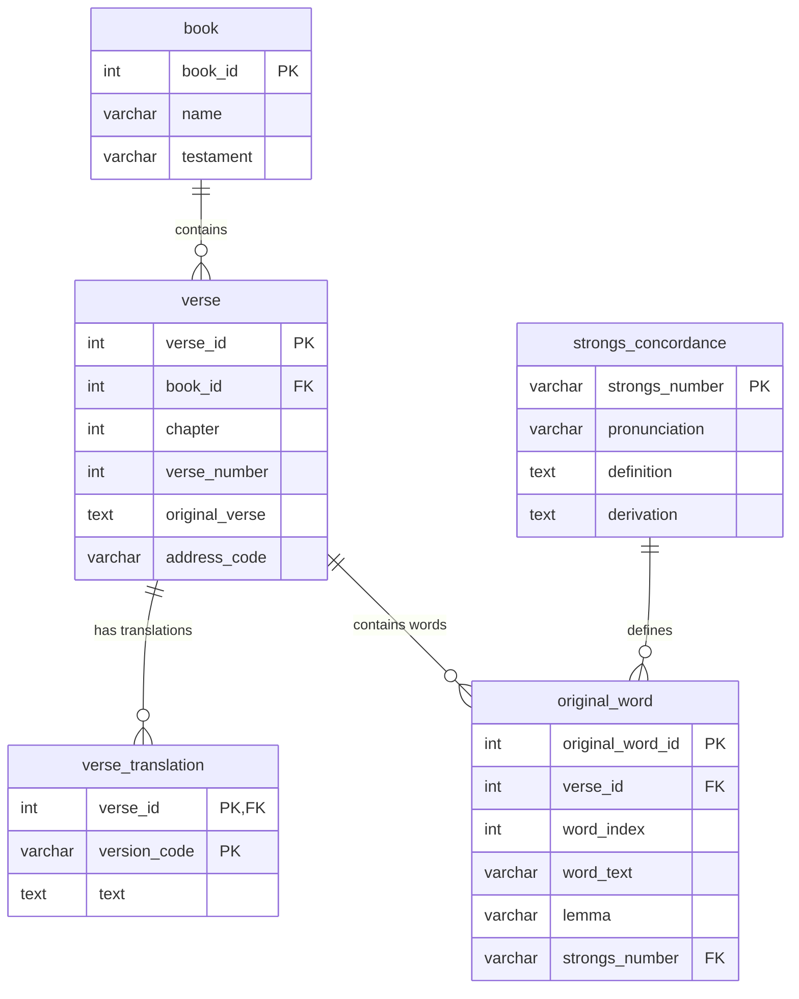
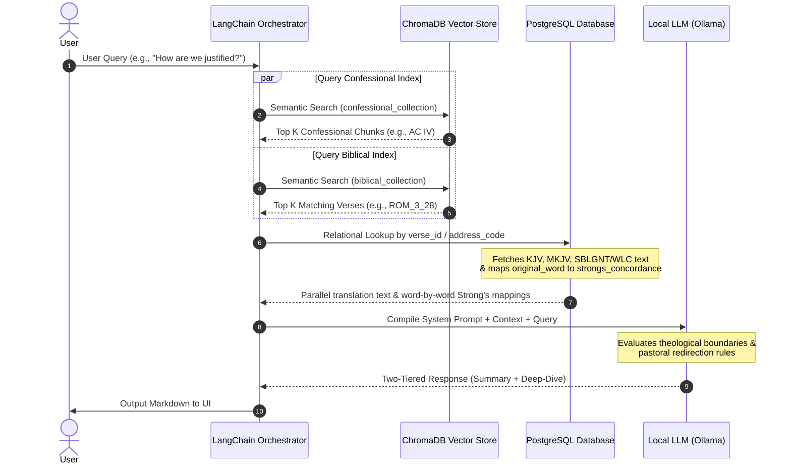

# Lutheran LLM Conversational Assistant - Technical Specification

This document provides the technical specification and architecture blueprint for the Lutheran LLM Conversational Assistant. The assistant is designed to answer inquiries about the Lutheran faith with absolute theological precision and strict adherence to confessional standards using a Retrieval-Augmented Generation (RAG) architecture.

---

## 1. System Architecture & Relational Schema (PostgreSQL)

The system utilizes PostgreSQL for the relational lookup of biblical scriptures, parallel translations, and original language fragments with Strong's Concordance numbers.



### Table Definitions

#### `book`
Stores the biblical books metadata.
*   `book_id` (INTEGER, PRIMARY KEY): Unique identifier (e.g., `45` for Romans).
*   `name` (VARCHAR(100)): Book name (e.g., `"Romans"`).
*   `testament` (VARCHAR(2)): Testament indicator (`"OT"` or `"NT"`).

#### `verse`
The master index of biblical verses.
*   `verse_id` (INTEGER, PRIMARY KEY): Unique identifier.
*   `book_id` (INTEGER, FOREIGN KEY references `book.book_id`).
*   `chapter` (INTEGER): Chapter number.
*   `verse_number` (INTEGER): Verse number.
*   `original_verse` (TEXT): Complete Greek or Hebrew text for quick, redundant lookup.
*   `address_code` (VARCHAR(50)): Unique code mapping (e.g., `"ROM_3_28"`).

#### `verse_translation`
Parallel textual translations decoupled from static table columns to facilitate easy extension.
*   `verse_id` (INTEGER, FOREIGN KEY references `verse.verse_id`).
*   `version_code` (VARCHAR(10)): Translation code (e.g., `"WEB"`, `"KJV"`, `"MKJV"`).
*   `text` (TEXT): The translation text.
*   *Primary Key:* (`verse_id`, `version_code`).

#### `original_word`
Word-by-word tokenized original text to map lexical details.
*   `original_word_id` (SERIAL, PRIMARY KEY).
*   `verse_id` (INTEGER, FOREIGN KEY references `verse.verse_id`).
*   `word_index` (INTEGER): Zero-indexed order of the word in the verse.
*   `word_text` (VARCHAR(100)): Exact word form in Greek/Hebrew.
*   `lemma` (VARCHAR(100)): Dictionary root form.
*   `strongs_number` (VARCHAR(10), FOREIGN KEY references `strongs_concordance.strongs_number`).

#### `strongs_concordance`
Lexical resources for Hebrew and Greek root words.
*   `strongs_number` (VARCHAR(10), PRIMARY KEY): Strong's code (e.g., `"G1722"`, `"H7225"`).
*   `pronunciation` (VARCHAR(100)): Phonetic spelling.
*   `definition` (TEXT): Definition and semantic range.
*   `derivation` (TEXT): Root origin.

---

## 2. Ingestion & Vector Search Flow

The system processes source materials using custom parsers and LangChain loaders to generate vector indexes in ChromaDB.

```
                  ┌──────────────────────────────┐
                  │   Ingestion Source Material  │
                  └──────────────┬───────────────┘
                                 │
         ┌───────────────────────┴───────────────────────┐
         ▼                                               ▼
┌─────────────────────────────────┐             ┌─────────────────────────────────┐
│ Book of Concord Triglot Ingest  │             │     Scripture Ingest (WEB)      │
├─────────────────────────────────┤             ├─────────────────────────────────┤
│ Parser: BeautifulSoup HTML      │             │ Parser: DB Translation Loader   │
│ Chunk: Paragraphs               │             │ Chunk: Individual Verses        │
│ Embed Model: all-MiniLM-L6-v2   │             │ Embed Model: all-MiniLM-L6-v2   │
└──────────────┬──────────────────┘             └──────────────┬──────────────────┘
               │                                               │
               ▼                                               ▼
┌─────────────────────────────────┐             ┌─────────────────────────────────┐
│     confessional_collection     │             │       biblical_collection       │
│          (ChromaDB)             │             │           (ChromaDB)            │
└─────────────────────────────────┘             └─────────────────────────────────┘
```

### Ingestion Logic
1.  **Confessional Chunking:** Raw HTML files from the public-domain *Triglot Concordia* are parsed. Chunks are generated strictly per paragraph, annotated with metadata (`book`, `article_id`, `paragraph_number`, and `citation`) to prevent context bleeding.
2.  **Biblical Ingestion:** The designated primary search version (e.g., `"WEB"`) is loaded from `verse_translation` and embedded at the single-verse level. Metadata includes `verse_id`, `address_code`, `book_name`, `chapter`, and `verse_number`.
3.  **Vector Persistence:** Chunks are converted to embeddings using `all-MiniLM-L6-v2` and stored in separate ChromaDB collections to allow targeted semantic retrieval.

---

## 3. RAG Retrieval & Prompt Orchestration

The application logic operates in a stateless loop to combine semantic matches with relational context before invoking the LLM.



### Prompt Guardrails & Redirection Boundaries
*   **Theological Boundaries:** If the search context has no matches or does not address speculative queries, the LLM outputs a standard humility response: *"Scripture and the Confessions are silent on this matter; therefore, I cannot answer."*
*   **Pastoral Redirection:** A preprocessing rule analyzes the user query for crisis-related terms. If triggered, it returns an immediate Gospel assurance and directs the user to seek confessional pastoral care.
*   **System Prompt Blueprint:**
    ```plaintext
    You are a strictly orthodox confessional Lutheran AI assistant. 
    Your objective is to provide clear, faithful, and scripturally grounded answers to inquiries about the Lutheran faith.

    CRITICAL INSTRUCTIONS:
    1. Base your assertions exclusively on the verified text snippets provided to you from Holy Scripture and the Book of Concord. Do not invent, extrapolate, or introduce heterodox teachings.
    2. If the provided context is silent on a speculative matter, explicitly state that Scripture does not reveal an answer.
    3. If a query indicates intense personal guilt, spiritual crisis, or a need for pastoral counseling, provide immediate comforting Gospel assurance and direct the user to consult a local pastor.

    RESPONSE FORMAT:
    You must structure your response exactly as follows:
    - Tier 1 (Summary): Write a warm, highly clear, and accessible explanation in plain modern English suitable for a lay person. Use the primary translation text provided in the context for quotes.
    - Tier 2 (Deep-Dive): Append an HTML collapsible section exactly like this:
    <details>
    <summary>Theological Depth</summary>
    Provide the verbatim passages from the Triglot Book of Concord alongside precise article and paragraph citations.
    Provide the matching parallel verses from alternate translations (KJV/MKJV).
    Provide the original language Greek/Hebrew text fragments accompanied by their corresponding Strong's Numbers and root definitions.
    </details>
    ```

---

## 4. Response Formatting & UI Layout

The system delivers a markdown-structured string that the frontend renders natively:

```markdown
[Warm, clear explanation of the theological topic in plain English, citing the primary translation (WEB).]

<details>
<summary>Theological Depth</summary>

### Book of Concord Citations
*   **Augsburg Confession, Article IV (Of Justification), Paragraph 1:**
    > "Also they teach that men cannot be justified before God by their own strength..."

### Parallel Scriptural Translations
*   **Romans 3:28**
    *   **WEB (Primary):** "We maintain therefore that a man is justified by faith apart from the works of the law."
    *   **KJV:** "Therefore we conclude that a man is justified by faith without the deeds of the law."
    *   **MKJV:** "Therefore we conclude that a man is justified by faith without the works of the law."

### Original Language Lexicon
*   **Romans 3:28 (Greek)**
    *   **λογιζόμεθα** (logizometha) — *Strong's G3049*: "To reckon, calculate, count; to take into account."
    *   **πίστει** (pistei) — *Strong's G4102*: "Faith, belief, trust, confidence."
    *   **δικαιοῦσθαι** (dikaiousthai) — *Strong's G1344*: "To declare righteous, justify."
    *   **χωρὶς** (chōris) — *Strong's G5565*: "Apart from, without."
    *   **ἔργων** (ergōn) — *Strong's G2041*: "Work, deed, action."
    *   **νόμου** (nomou) — *Strong's G3551*: "Law, rule."
</details>
```

---

## 5. Technology Stack & GCP Migration Strategy

The system is developed using modular components to facilitate seamless migration from a local workstation to Google Cloud Platform.

| Component | Local Prototyping Stack | GCP Production Migration |
| :--- | :--- | :--- |
| **Language Runtime** | Python 3.10+ | Cloud Run (Containerized) |
| **Relational Database** | Local PostgreSQL instance | Cloud SQL for PostgreSQL |
| **Vector DB** | ChromaDB (Local Disk Persistence) | Vertex AI Vector Search |
| **Embedding Model** | `all-MiniLM-L6-v2` (SentenceTransformers) | Vertex AI Embeddings (Gecko) |
| **Language Model** | Ollama (Llama 3 / Mistral) | Vertex AI Gemini Pro API |
| **Orchestration** | LangChain / LangGraph | Vertex AI Agent Builder / Cloud Run |

---

## 6. Directory Layout

```text
lutheran-llm/
├── config/
│   └── settings.py          # Environment configs (DB credentials, PRIMARY_SEARCH_VERSION)
├── database/
│   ├── connection.py        # SQLAlchemy / asyncpg PostgreSQL connection pool
│   ├── schema.sql           # Database table definitions & indices
│   └── queries.py           # SQL queries for parallel verses and Strong's lookup
├── ingestion/
│   ├── parse_concord.py     # HTML parser for Book of Concord Triglot
│   ├── parse_bible.py       # Ingests translations & tokenizes original languages
│   └── vector_indexer.py    # Generates vectors and writes to ChromaDB collections
├── pipeline/
│   ├── orchestrator.py      # LangChain retrieval chain & orchestration loop
│   ├── prompt.py            # Immutable system prompt template
│   └── guardrails.py        # Crisis detection & pastoral redirection logic
├── ui/
│   └── app.py               # Streamlit-based local testing dashboard
├── requirements.txt         # Project dependencies
└── prd.md                   # Product Requirements Document
```
