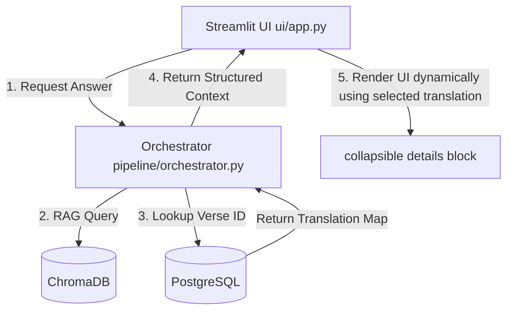

# Design: Lexicon Removal & Dynamic Translation Rendering

This design addresses dropping Greek Lexicon analysis from the assistant to focus fully on Scripture and the Book of Concord, and implements dynamic Bible translation re-rendering in the UI.

## Objectives
1.  **Drop Lexicon Analysis**: Remove `original_word` and `strongs_concordance` tables and logic.
2.  **Configurable Context Bounds**: Default RAG retrieval to `2` Book of Concord passages and `10` Scripture passages.
3.  **Single Translation UI**: Only display the primary selected translation for Scripture.
4.  **Dynamic Re-Rendering**: Automatically update the translation of past responses when the selected translation changes in the sidebar.

## Architecture



### 1. Database Schema
*   Delete the tables `original_word` and `strongs_concordance` from `database/schema.sql`.
*   Update database connection and model tests to ensure they do not check for these tables.

### 2. Seeding & Ingestion Pipeline
*   Remove all lexical parser and seeder code from `ingestion/ingest_all.py`.
*   Ingest only:
    - Protestant canonical books (66 rows in `book`)
    - Bible verses (31,103 rows in `verse`)
    - Parallel Bible translations (93,303 rows in `verse_translation`)
    - Book of Concord markdown chunk vector indices in ChromaDB.
    - New Testament verse vector indices in ChromaDB.

### 3. RAG Retriever & Formatter
*   Set default settings in `config/settings.py`:
    - `rag_confessional_k = 2`
    - `rag_biblical_k = 10`
*   Refactor `retrieve_context` to output structured context without lexicon lookups.
*   Update formatting utilities to bypass lexicon formatting.

### 4. UI Chat History
*   Store assistant responses in `st.session_state.messages` as structured dictionaries:
    ```python
    {
        "role": "assistant",
        "summary": "LLM text response...",
        "retrieved_ctx": {
            "confessional": [{"text": "...", "citation": "..."}],
            "scriptures": [{"citation": "Luke 12:50", "translations": {"WEB": "...", "KJV": "...", "MKJV": "..."}}]
        }
    }
    ```
*   When rendering the page, format the HTML details block dynamically based on the active sidebar selection:
    `selected_translation = st.sidebar.selectbox(...)`
